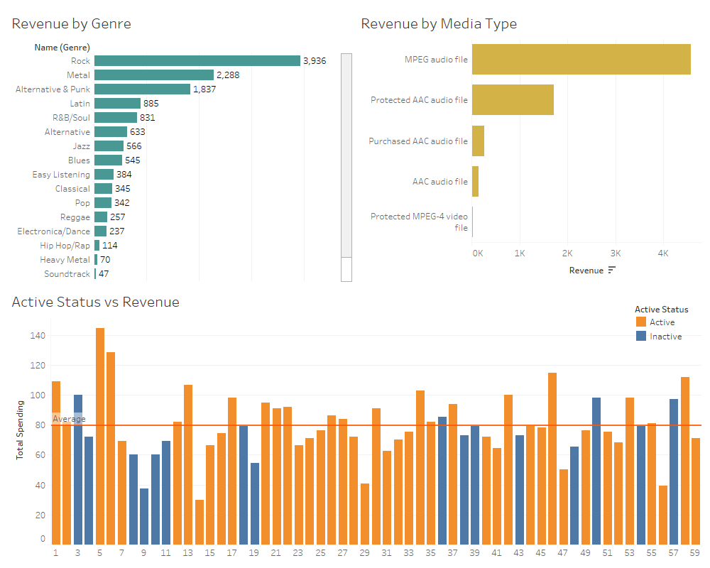

# Online Music Store Analysis

This project analyzes data from a fictional online music store to uncover business insights and provide actionable recommendations for improving revenue, customer retention, and inventory management. The analysis includes database creation and querying using MySQL, as well as interactive visualizations in Tableau.

---

## Table of Contents

1. [Introduction](#introduction)  
2. [Goals and Objectives](#goals-and-objectives)  
3. [Dataset Description](#dataset-description)  
4. [Methodology](#methodology)  
   - [Database Design and Management](#database-design-and-management)  
   - [Data Loading and Cleaning](#data-loading-and-cleaning)  
   - [Analysis and Insights](#analysis-and-insights)  
5. [Results and Visualizations](#results-and-visualizations)  
6. [Technical Skills Demonstrated](#technical-skills-demonstrated)  
7. [How to Run the Project](#how-to-run-the-project)  
8. [Technical Skills Demonstrated](#technical-skills-demonstrated)  
9. [How to Run the Project](#how-to-run-the-project)

---

## Introduction

Online music stores generate vast amounts of transactional data, which can be analyzed to optimize revenue streams and improve customer experience. This project addresses business questions such as:
- What are the top-selling genres, albums, and artists?
- Which countries and customer segments generate the most revenue?
- What factors contribute to customer churn, and how can they be addressed?

These insights aim to guide strategic decision-making for businesses in the e-commerce and entertainment industries.

---

## Goals and Objectives

The purpose of this project is to:
1. Design and implement a relational database to store and query music store data efficiently.  
2. Use SQL queries to answer key business questions and generate actionable insights.  
3. Create interactive Tableau dashboards to visualize findings for stakeholders.  
4. Provide actionable recommendations to enhance customer retention, optimize inventory, and increase revenue.  

---

## Dataset Description

The dataset contains transactional data from a fictional music store, including:  
- **Customers**: Demographics and purchasing behavior.  
- **Invoices**: Transactional details.  
- **Tracks, Albums, and Genres**: Music inventory and categorization.  
- **Artists**: Information on music creators.  
- **Playlists**: User engagement with curated collections.  

---

## Methodology

### Database Design and Management
- Designed a normalized relational database schema using MySQL, ensuring minimal redundancy and efficient querying.  
- The schema consists of tables for customers, invoices, tracks, genres, playlists, and more.  

### Data Loading and Cleaning
- Inspected and cleaned the raw data to resolve inconsistencies and missing values.  
- Loaded data into MySQL using automated SQL scripts to maintain data accuracy and consistency.  

### Analysis and Insights
- Used SQL queries to address key business questions, such as:  
  - Revenue distribution by country and genre.  
  - Top-selling artists, albums, and playlists.  
  - Customer churn and purchasing trends.  
- Visualized insights using Tableau dashboards for effective communication with stakeholders.  

---

## Results and Visualizations

Key findings from the analysis:  

1. **Customer Behavior and Sales Analysis**:  
   - **Revenue by Country**: The United States contributes 22% of total revenue, followed by Canada and Germany.  
   - **Genre Popularity**: Rock is the most popular genres followed by Metal and Alternative & Punk follow. Emphasizing these genres in marketing campaigns could help maximize revenue.  

2. **Product and Inventory Optimization**:  
   - MPEG audio files are the dominant format, comprising nearly 90% of all purchases and protected AAC audio files account for 9.23% of sales.  
   - Classic albums, such as those by, Jimi Hendrix "Queen" have the highest sales volume.  

3. **Marketing and Promotions**:  
   - Rock generates 55.4% of total revenue, suggesting marketing campaigns should prioritize this genre.  
   - Customers with larger playlists spend more money, highlighting the potential for playlist-based engagement strategies.
   - March shows the highest average revenue per invoice at $8.14, and Friday is the highest-grossing day at $8.60. This trend suggests opportunities to optimize sales and increase revenue per transaction.

**Tableau Dashboards**:  
-  
- 
   
- 
- 

-  

---
## Conclusion and Recommendations

This project highlights the potential of data analytics in improving the operations of an online music store. Key conclusions include:

1. **Revenue by Country**: The United States leads in total revenue, contributing 22.09%, followed by Canada and Brazil. However, countries like the Czech Republic exhibit the highest revenue per customer, suggesting a potential market for premium content.

2. **Music Genre Insights**: Rock music dominates global sales with a 55.39% share, making it the top revenue-driving genre. Metal and Alternative & Punk also contribute significantly, suggesting a focus on these genres for marketing campaigns.

3. **Customer Engagement**: Customers with larger playlists spend 20% more, highlighting the potential of personalized recommendations and playlist-based engagement strategies to drive sales.

4. **Media Preferences**: MPEG audio files account for 80% of purchases, confirming the dominance of digital formats. Investments in expanding the digital catalog and improving the digital customer experience will yield higher returns.

5. **Seasonal and Weekly Trends**: Revenue peaks in March and September, with weekly spikes on Fridays and Saturdays. Marketing efforts and discounts can be targeted during these periods to maximize sales.

### Actionable Recommendations:

- **Expand Digital Offerings**: Increase the variety of digital formats, focusing on MPEG audio files, which dominate customer preferences.
- **Targeted Marketing Campaigns**: Leverage popular genres like Rock and Metal for region-specific promotions. Develop campaigns for high-revenue countries like the United States and Canada while exploring premium offerings in regions like the Czech Republic.
- **Enhance Customer Engagement**: Use personalized playlists and dynamic recommendations to encourage higher spending, particularly among engaged customers.
- **Seasonal and Weekly Promotions**: Run promotional campaigns during peak months (March, September) and on weekends to maximize revenue during high-traffic periods.

By implementing these recommendations, the online music store can enhance its market position, optimize inventory, and increase customer retention.

---

## Technical Skills Demonstrated

This project demonstrates proficiency in:  
- **SQL**: Database creation, data loading, and complex queries for insights.  
- **Tableau**: Interactive dashboards for data visualization.  
- **Database Design**: Schema normalization using MySQL.  
- **ETL Processes**: Automated data cleaning and loading.  

---

## How to Run the Project

1. **Clone the repository**:  
   ```bash
   git clone https://github.com/yourusername/online-music-store-analysis.git
